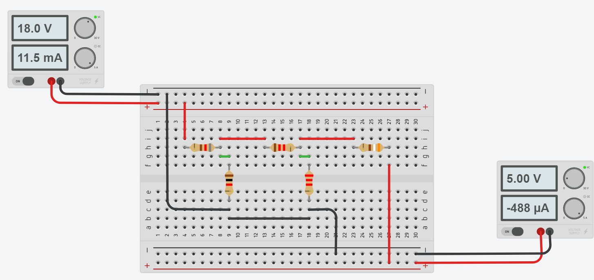

# Informe de laboratorio N°2
**Integrantes:**

Christian Bonifaz, Jean Jacome, Kevin Sandoval

**NRC:** 5406

**Docente:** Ing. Darwin Alulema

**Tema:** ANÁLISIS DE MALLAS

#### 1. OBJETIVOS 

#### 2. MARCO TEÓRICO 

#### 3. EXPLICACIÓN DEL PROCEDIMIENTO
3.1 El equipo requerido y utilizado para la elaboracion del circuito es el siguiente:

3.2 Implemente el circuito que se presenta en la figura 2.1.

3.3 Compare los valores de la tabla y realice sus conclusiones

#### 4. RESPUESTA A INTERROGANTES Y CALCULO DEL ERROR 
El Flujo de la corriente va a tomar este sentido

Encontramos la corriente aplicando la ley de voltajes de Kirchhoff

#### 5. VIDEO

#### 6. CONCLUSIONES 

#### 7. BIBLIOGRAFÍA

Salazar, A. (2021). ANÁLISIS POR NODOS Y MALLAS. Retrieved 9 June 2021, from http://wwwprof.uniandes.edu.co/~ant-sala/cursos/FDC/Contenidos/03_Analisis_por_Nodos_y_Mallas.pdf

Ley de Kirchhoff: Análisis de mallas. - HETPRO/TUTORIALES. (2018). Retrieved 9 June 2021, from https://hetpro-store.com/TUTORIALES/ley-de-kirchhoff-analisis-de-mallas/
