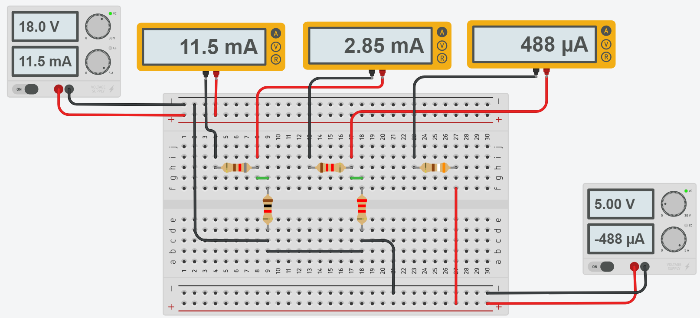

# Informe de laboratorio N°2
**Integrantes:**

Christian Bonifaz, Jean Jacome, Kevin Sandoval

**NRC:** 5406

**Docente:** Ing. Darwin Alulema

**Tema:** ANÁLISIS DE MALLAS

#### 1. OBJETIVOS 

-Comprender y analizar el concepto de malla y sus caracteristicas, asi como tambien su metodo de solucion para resolver circuitos planos.

#### 2. MARCO TEÓRICO 

#### 3. EXPLICACIÓN DEL PROCEDIMIENTO
3.1 El equipo requerido y utilizado para la elaboracion del circuito es el siguiente:

3.2 Implemente el circuito que se presenta en la figura 2.1.

3.3 Compare los valores de la tabla y realice sus conclusiones

#### 4. RESPUESTA A INTERROGANTES Y CALCULO DEL ERROR 
El Flujo de la corriente va a tomar este sentido

Encontramos la corriente aplicando la ley de voltajes de Kirchhoff

Se armo un sistema de ecuaciones

Resolviendo el sistema de Ecuaciones obtenemos

Mediante el simulador Tinkercad calculamos los resultamos simulados:

Calculo de Error

#### 5. VIDEO

#### 6. CONCLUSIONES 

-Por el método de resolucion de mallas podemos resolver circuitos planos complejos por medio de un sistema de ecuaciones, simplificando asi en muchos casos los procesos.

#### 7. BIBLIOGRAFÍA

Salazar, A. (2021). ANÁLISIS POR NODOS Y MALLAS. Retrieved 9 June 2021, from http://wwwprof.uniandes.edu.co/~ant-sala/cursos/FDC/Contenidos/03_Analisis_por_Nodos_y_Mallas.pdf

Ley de Kirchhoff: Análisis de mallas. - HETPRO/TUTORIALES. (2018). Retrieved 9 June 2021, from https://hetpro-store.com/TUTORIALES/ley-de-kirchhoff-analisis-de-mallas/
